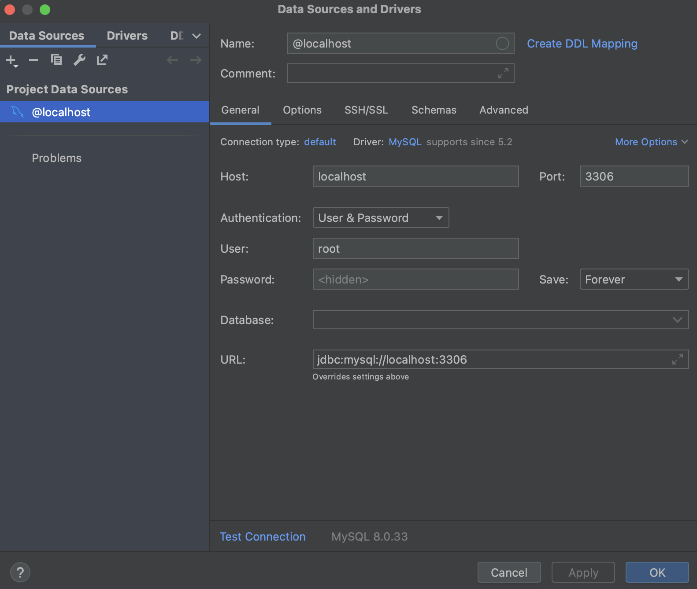

# jdbc02-todo

JDBC 라이브러리 활용하여 Todo CRUD 구현

## Spec

- Java 11
- Jdbc
- Gradle
- IntelliJ

## IntelliJ DB 연결(MySQL)

- IntelliJ IDEA -> Database -> `+` 버튼 -> Data Source -> MySQL 클릭
- General 탭 -> Host: localhost / Port: 3306 / User: root / Password: 1121 / URL: jdbc:mysql://localhost:3306
- 설정을 마치면, Apply 및 Ok 버튼 클릭



- Database -> `@localhost` 마우스 우클릭 -> Navigation - `Jump to Query Console` -> `Open Default Console` 클릭


- 해당 Console 창 안에서 아래의 SQL 명령어 입력

```sql
use testdb;

CREATE TABLE todo (
                      id INT(5) unsigned NOT NULL AUTO_INCREMENT,
                      title VARCHAR(255),
                      description VARCHAR(255),
                      due_date DATE,
                      is_completed BOOLEAN DEFAULT false,
                      PRIMARY KEY (id)
);

INSERT INTO TODO (title, description, due_date) VALUES ('숙제하기', '수학, 영어 숙제를 한다', '2022-04-05');

INSERT INTO TODO (title, description, due_date) VALUES ('조깅하기', '공원에서 1시간 동안 조깅을 한다.', '2022-05-07');

INSERT INTO TODO (title, description, due_date) VALUES ('빨래하기', '빨래를 모아서 세탁기를 돌린다.', '2022-04-04');

INSERT INTO TODO (title, description, due_date) VALUES ('피아노치기', '학원에서 피아노를 연습한다.', '2022-04-09');

INSERT INTO TODO (title, description, due_date) VALUES ('강아지 밥주기', '강아지에게 사료를 준다.', '2022-04-07');

commit;

select *
from todo;
```

- 명령어 입력 후에 실행(cmd + enter)해서 결과 확인 - 하단 `Services` 탭 - testdb.todo 테이블에서 확인 가능


## CRUD 구현 후 실행

- App 클래스에서 시작

### 실행결과 예시

#### 1. 추가, 수정, 삭제 중 하나라도 하는 경우

```
// 전체 조회
1 번째로 해야 할 일은 숙제하기 입니다.
기한은 2022년 04월 05일 까지입니다.

2 번째로 해야 할 일은 조깅하기 입니다.
기한은 2022년 05월 07일 까지입니다.

3 번째로 해야 할 일은 빨래하기 입니다.
기한은 2022년 04월 04일 까지입니다.

4 번째로 해야 할 일은 피아노치기 입니다.
기한은 2022년 04월 09일 까지입니다.

5 번째로 해야 할 일은 강아지 밥주기 입니다.
기한은 2022년 04월 07일 까지입니다.

// 조회할 id 값 입력
조회할 id 값을 입력해 주세요.
1
1 숙제하기 수학, 영어 숙제를 한다
기한은 2022년 04월 05일 까지 입니다.

// 추가
테이블을 추가하실 거에요? (네 : 1 / 아니요 : 2)
1
추가할 todo title를 입력해 주세요.
1번제목
추가할 todo description를 입력해 주세요.
1번설명
추가할 todo due_date를 입력해 주세요.
2023-06-17
정상 등록 되었습니다.
테이블 추가(title, description, due_date)를 반복하실 건가요?(1: 계속 / 2: 그만)
2

// 수정
테이블을 수정하실 거에요? (네 : 1 / 아니요 : 2)
2

// 삭제
테이블을 삭제하실 거에요? (네 : 1 / 아니요 : 2)
2

// 종료
BUILD SUCCESSFUL in 35s
2 actionable tasks: 1 executed, 1 up-to-date
2:42:46 PM: Execution finished ':App.main()'.
```

- Database - `console` 에서 SQL 명령어로 확인하면(`SELECT * FROM todo;`) 하나가 추가된 것을 확인할 수 있다.

#### 2. 추가, 수정, 삭제를 모두 안하는 경우

```
// 전체 조회
1 번째로 해야 할 일은 숙제하기 입니다.
기한은 2022년 04월 05일 까지입니다.

2 번째로 해야 할 일은 조깅하기 입니다.
기한은 2022년 05월 07일 까지입니다.

3 번째로 해야 할 일은 빨래하기 입니다.
기한은 2022년 04월 04일 까지입니다.

4 번째로 해야 할 일은 피아노치기 입니다.
기한은 2022년 04월 09일 까지입니다.

5 번째로 해야 할 일은 강아지 밥주기 입니다.
기한은 2022년 04월 07일 까지입니다.

// 조회할 id 값 입력
조회할 id 값을 입력해 주세요.
1
1 숙제하기 수학, 영어 숙제를 한다
기한은 2022년 04월 05일 까지 입니다.

// 추가
테이블을 추가하실 거에요? (네 : 1 / 아니요 : 2)
2

// 수정
테이블을 수정하실 거에요? (네 : 1 / 아니요 : 2)
2

// 삭제
테이블을 삭제하실 거에요? (네 : 1 / 아니요 : 2)
2

// 종료
BUILD SUCCESSFUL in 35s
2 actionable tasks: 1 executed, 1 up-to-date
2:42:46 PM: Execution finished ':App.main()'.
```
